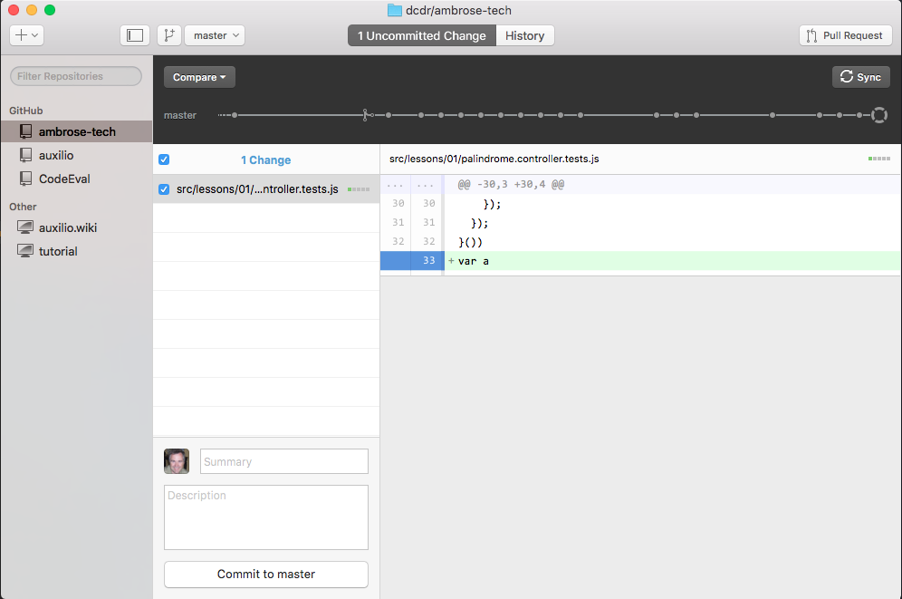

# Commit and Sync Changes

1. Select the Uncommitted Change(s) tab.
2. Select the files you want to commit.
3. Enter a summary for the purpose of your change and, optionally, a more detailed description.
4. Click the "Commit to <your branch name>" button. At this point, your changes are only in your
local repository. If you are working in your own GitHub project, then you may wish to sync your
branch to the origin server (GitHub). Click the Sync button to copy your changes to GitHub.

