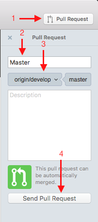

# Pull Request

Issue pull requests to ask the repository manager to review and potentially merge your changes into the GitHub
repository.

1. Click the Pull Request button.
2. Enter a summary of your change (defaults to your branch name).
3. Select the branch you want to merge to (generally dev).
4. Click the Send Pull Request button.

